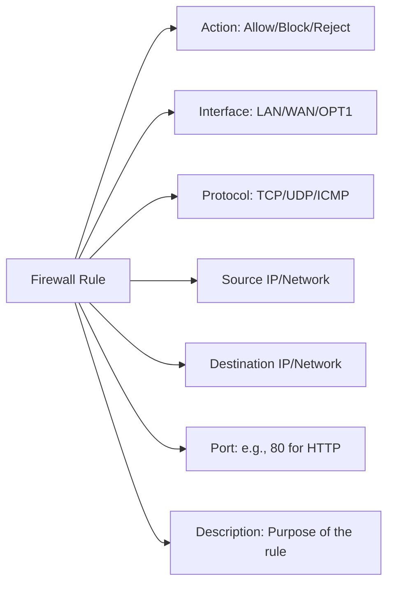

# Understanding and Creating Firewall

At the simplest level, firewall rules are instructions that tell the firewall what to do with network traffic — whether to allow it or block it.  
They help protect our networks by controlling which devices can communicate and under what conditions.

## Anatomy of a Firewall Rule

Let’s break down the parts of a firewall rule. Each rule has:

- **Action** — pass, block, or reject.  
- **Interface** — like LAN, WAN, or OPT1.  
- **Protocol** — TCP, UDP, or ICMP.  
- **Source and Destination** — the IPs or networks involved.  
- **Port** — for example, port 80 for HTTP.  
- **Description** — important, because a good description tells you what the rule is for.

### Firewall Rule Diagram

## Creating Effective Rules

To create effective firewall rules, follow two key principles:

1. Write **specific allow rules** — don’t just leave wide-open access.  
2. Use a **block-all rule** at the bottom to catch everything else.  

## Best Practices

Here are a few best practices for working with firewall rules:

- Always write a good description for each rule.  
- Apply changes carefully — avoid doing too many at once without testing.  
- Make sure to back up your configuration before making major rule changes.
