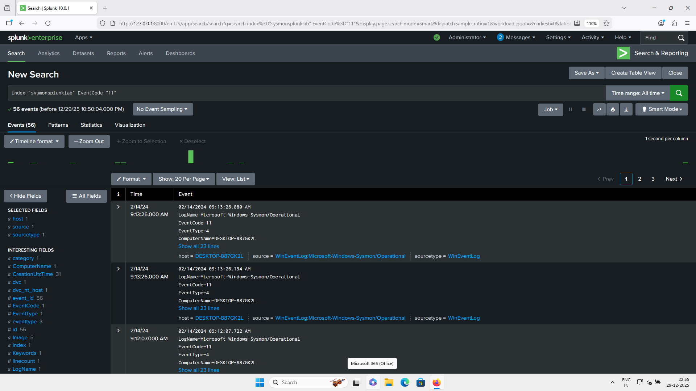
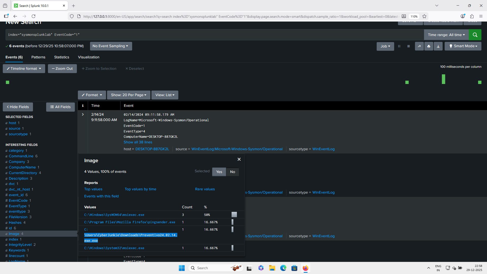
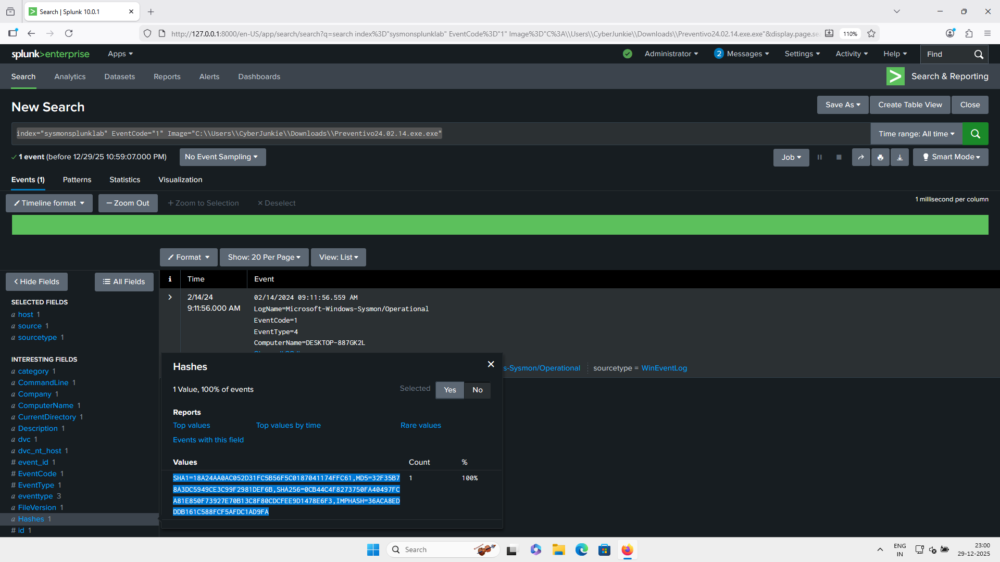
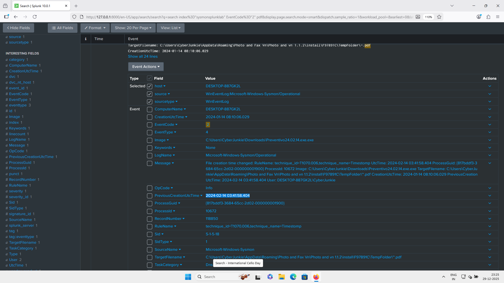
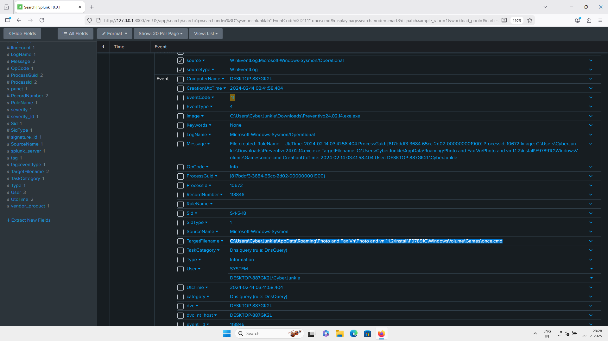
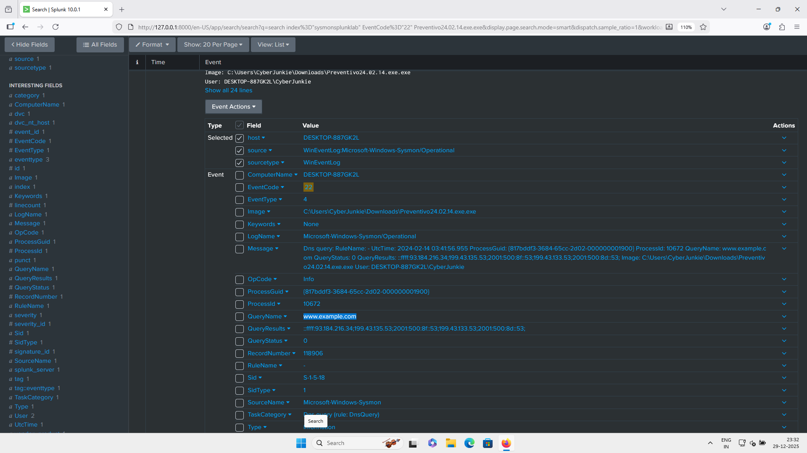
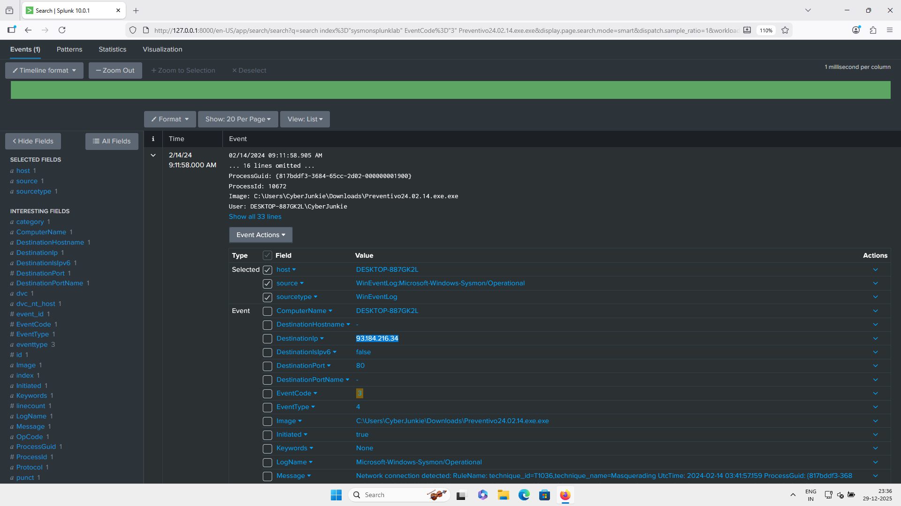
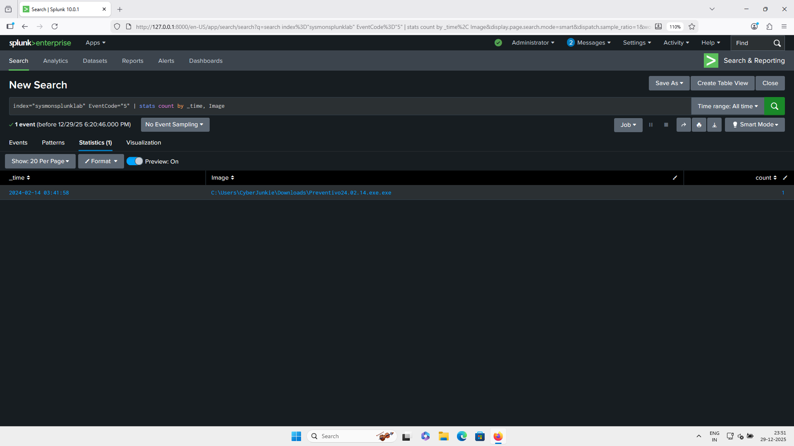

# UltraVNC Initial Access Analysis (Sysmon Log Lab)

---

## Overview

This lab is inspired by **Palo Alto Unit 42 research** on an **UltraVNC malware campaign**, where attackers used a **backdoored UltraVNC binary** to maintain persistent access.

we will review Sysmon events to identify:

* Malicious process activity
* File creation and modification
* Network communication
* Process termination behavior

---

## Log File

* **Log File:** *Download from Asset*

---

## Sysmon Event IDs Reference

Use the following Sysmon Event IDs while answering the questions:

### Process & Execution

* **Event ID 1** – Process Creation
* **Event ID 5** – Process Terminated
* **Event ID 8** – CreateRemoteThread
* **Event ID 10** – Process Access
* **Event ID 25** – Process Tampering

### File System Activity

* **Event ID 2** – File Creation Time Changed
* **Event ID 11** – File Created
* **Event ID 15** – File Create Stream Hash
* **Event ID 23** – File Deleted (Archived)
* **Event ID 26** – File Deleted (Logged)
* **Event ID 29** – Executable File Created

### Network Activity

* **Event ID 3** – Network Connection
* **Event ID 22** – DNS Query

### Registry & Persistence

* **Event ID 12** – Registry Create/Delete
* **Event ID 13** – Registry Value Set
* **Event ID 14** – Registry Rename

### Advanced & System Events

* **Event ID 4** – Sysmon Service State Change
* **Event ID 6** – Driver Loaded
* **Event ID 7** – Image Loaded
* **Event ID 17** – Named Pipe Created
* **Event ID 18** – Named Pipe Connected
* **Event ID 19–21** – WMI Persistence Events
* **Event ID 16** – Sysmon Configuration Change

---

## Investigation Questions

Answer the following based on your analysis of the Sysmon logs:

1. How many files were created during the attack?

**Answer -** 56

```spl
index="sysmonsplunklab" EventCode="11"
```


2. What was the **malicious process** that infected the victim system?

**Answer -** Preventivo24.02.14.exe.exe

```spl
index="sysmonsplunklab" EventCode="1"
```



```spl
index="sysmonsplunklab" EventCode="1" Image="C:\\Users\\CyberJunkie\\Downloads\\Preventivo24.02.14.exe.exe"
```



Now Check on Virus Total 


3. Which **cloud drive service** was used to distribute the malware?

**Answer -** Dropbox

```spl
index="sysmonsplunklab" EventCode="22"
```


4. What timestamp was set for a **PDF file** whose creation time was modified?

**Answer -** 	2024-01-14 08:10:06.029

```spl
index="sysmonsplunklab" EventCode="2" pdf
```



5. Where was **`once.cmd`** created on disk?
   *(Provide full file path including filename.)*

**Answer -** C:\Users\CyberJunkie\AppData\Roaming\Photo and Fax Vn\Photo and vn 1.1.2\install\F97891C\WindowsVolume\Games\once.cmd

```spl
index="sysmonsplunklab" EventCode="11" once.cmd
```


6. Which **dummy domain** did the malware attempt to contact to verify internet connectivity?

**Answer -** www.example.com

```spl
index="sysmonsplunklab" EventCode="22" Preventivo24.02.14.exe.exe
```



7. Which **IP address** did the malicious process try to reach?

**Answer -** 93.184.216.34

```spl
index="sysmonsplunklab" EventCode="3" Preventivo24.02.14.exe.exe
```



8. When did the malicious process **terminate itself** after deploying the backdoored UltraVNC?

**Answer -** 2024-02-14 03:41:58

```spl
index="sysmonsplunklab" EventCode="5" | stats count by _time, Image
```



---


