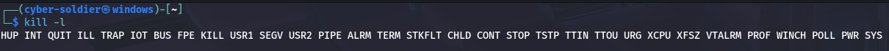

# 🧠 Understanding Linux Processes & System Monitoring

In Linux, anything that runs — whether system-driven or user-initiated — is treated as a **process**. These are active programs or commands executed to perform tasks.

---

## 🔍 Viewing Processes

### `ps` — Process Status

| Command               | Description |
|----------------------|-------------|
| `ps`                 | Shows currently running processes **on the current terminal** |
| `ps -u <username>`   | Shows processes running by a specific user |
| `ps -aux`            | Displays **all system processes** with users and details |

---

## 📊 Monitoring Running Processes

| Command   | Description |
|-----------|-------------|
| `top`     | Displays real-time processes sorted by CPU/memory usage |
| `htop`    | A more user-friendly version of `top` with an interactive interface |

---

## ⏳ Foreground vs Background Processes

### Foreground Process:
Runs actively in the terminal and prevents you from using the shell until it finishes.

### Background Process:
Runs behind the scenes, allowing continued use of the terminal.

---

### 🔄 Managing Background Processes

| Action                       | Command Example |
|-----------------------------|-----------------|
| View running/sleeping jobs  | `jobs`          |
| Stop a process              | Press `Ctrl + C`|
| Suspend a process           | Press `Ctrl + Z`|
| Resume in background        | `bg <job-id>`   |
| Run command in background   | `command &`     |
| Bring background to foreground | `fg <job-id>` |

---

## ❌ Killing a Process

To terminate a running process:

### 🔪 Kill by PID

```bash
kill <process-id>
```

### 🔫 Using Kill Signals

```bash
kill -<signal> <process-id>
```

List all available kill signals:

```bash
kill -l
```



### 🔎 Kill by Name

```bash
pkill -<signal> <process-name>
```

---

# 🧪 Mini Lab – Day 12: "Suspicious Process Hunt"

🎯 **Mission**: A strange lag has been reported on the system.  
You are tasked with identifying and terminating any suspicious process consuming high CPU resources.

---

📁 Solution and hints can be found in the `Labs` directory.

---

> 🧠 Pro Tip: Always be cautious when using kill — terminating system-critical processes can cause crashes or instability.
