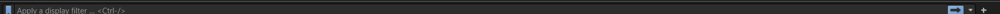
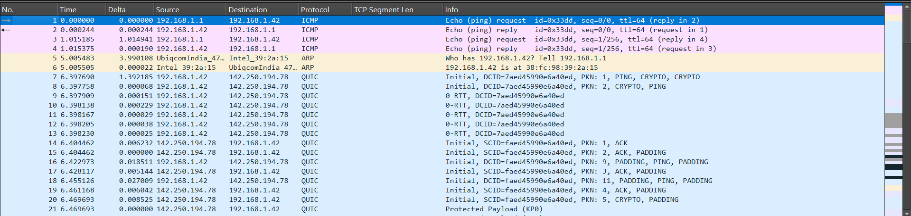
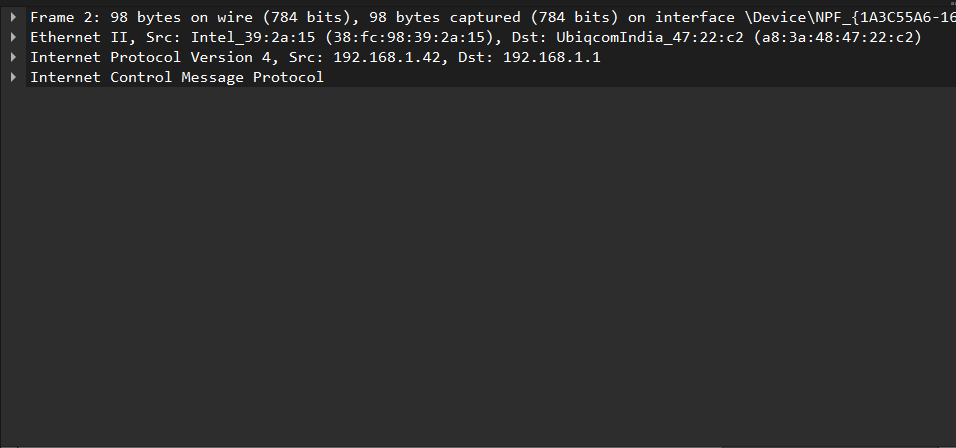
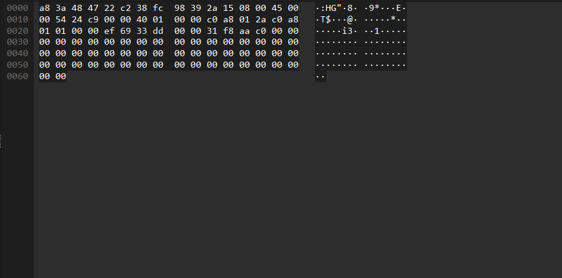

# 🕵️ Wireshark: Network Traffic Analysis Tool

Wireshark is like a **detective tool** for computer networks. It can capture and inspect all the transmissions happening over a network via various interfaces like **Wi-Fi**, **Ethernet**, and more.

It is an essential tool for **network engineers, cybersecurity professionals, and students** to monitor network packets and understand underlying protocols.

> 🔗 For a comprehensive guide, visit: [StationX - How to Use Wireshark](https://www.stationx.net/how-to-use-wireshark-to-capture-network-traffic/)

---

## ✅ Key Uses of Wireshark

Wireshark is cross-platform and works on **Windows, Linux, and macOS**.

- Live packet capture
- Analyze data from other tools
- Import and analyze hex dumps
- Export captured data in various formats
- In-depth packet analysis
- Generate statistics and graphs
- Decode encrypted data (where possible)

---

## ⚙️ Installation

> **Note:** No installation is required in **Kali Linux**, as it comes pre-installed.

### For other systems:

1. Visit the official Wireshark website: [https://www.wireshark.org](https://www.wireshark.org)
2. Download the installer based on your OS.
3. Run the installer and complete the setup.

---

## 🚀 Getting Started

Before using Wireshark, it is important to understand **networking protocols**.

### Launching Wireshark:

1. Open Wireshark.
2. Select a network interface (Wireshark auto-detects available interfaces).
3. Begin packet capture.

---

## 🖥️ Wireshark Interface Overview
1. **Menu Bar** – Contains all tools and settings.


2. **Toolbar** – Provides quick access to frequently used actions.


3. **Filter Bar** – Allows you to apply filters to find specific packets.


4. **Packet List Panel** – Displays a list of captured packets.


5. **Packet Details Pane** – Shows decoded information of a selected packet.


6. **Packet Bytes Pane** – Displays the raw hexadecimal data of a packet.


7. **Status Bar** – Located at the bottom, shows Wireshark activity status and interface info.


---

## 📦 Capturing Your First Packets

1. Launch Wireshark and select a network interface.
2. Open a web browser and start browsing to generate traffic.
3. Wireshark will capture all network packets on the selected interface.
4. To save captured data:
   - Stop the capture. 
   - Click the **Save** icon in the toolbar.  
   - Choose a location and save the capture file for analysis.

> 🧪 *Go and try this now!*

---

## 🧹 Profiling & Filtering Options in Wireshark

Wireshark offers two main types of filters:

### 1️⃣ Capture Filters

- Used **before** packet capture starts.
- Allow capturing **only specific packets** while discarding others.

### 2️⃣ Display Filters

- Applied **after** capture.
- **Hide irrelevant packets** without discarding them.
- Useful for focusing analysis.

---

## 🗂️ Profiling in Wireshark

Wireshark allows users to save **customized settings and views** using profiles. This helps keep your workspace tailored for different types of analysis tasks.

---

## 🔎 Common Filtering Options in Wireshark

Wireshark allows you to apply filters to narrow down captured packets for better analysis. Here's a quick reference for commonly used filters:

---

### 🔁 Protocol-Based Filters

| Filter       | Purpose                                       |
|--------------|-----------------------------------------------|
| `tcp`        | Filters TCP packets (e.g., web browsing, FTP) |
| `udp`        | Filters UDP packets (e.g., video, VoIP)       |
| `http`       | Filters HTTP traffic (web server analysis)    |

---

### 📍 Address-Based Filters

Filter packets by IP or MAC address:

```bash
ip.addr == <IP-Address>        # Filter communication with a specific IP
eth.addr == <MAC-Address>      # Filter traffic by MAC (device-level filtering)
```

---

### 📦 Port-Based Filters

Ports help identify specific services and traffic:

```bash
tcp.port == 80     # Filters HTTP packets (port 80)
udp.port == 53     # Filters DNS packets (port 53)
```

---

## ⚙️ Logical Operators in Filters

| Operator     | Meaning                | Description                                                     | Example                                             |
|--------------|------------------------|-----------------------------------------------------------------|-----------------------------------------------------|
| `&&`         | AND                    | Shows packets matching **all** combined conditions              | `tcp.port == 80 && ip.addr == 192.168.2.1`          |
| `or`         | OR                     | Shows packets matching **either** condition                     | `tcp.port == 443 or tcp.port == 80`                 |
| `!` / `not`  | NOT (Negation)         | Excludes packets matching a condition                           | `!ip.addr == 192.168.12.60`                         |

---

> 🧠 *Mastering Wireshark's filtering, interface, and capture techniques is a key skill for network security and forensic analysis.*
